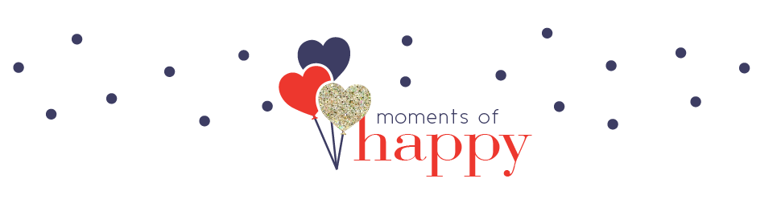
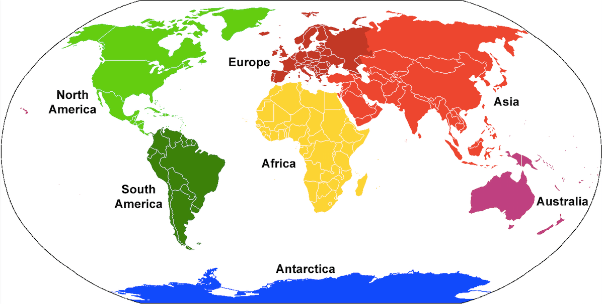
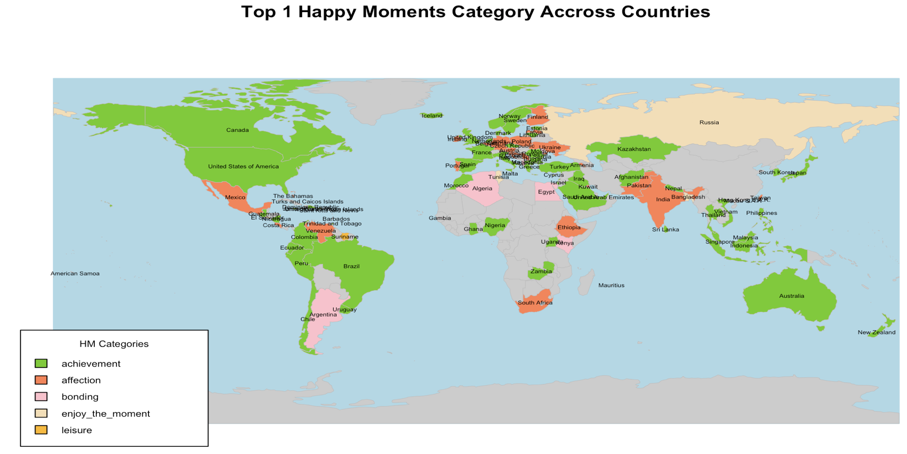
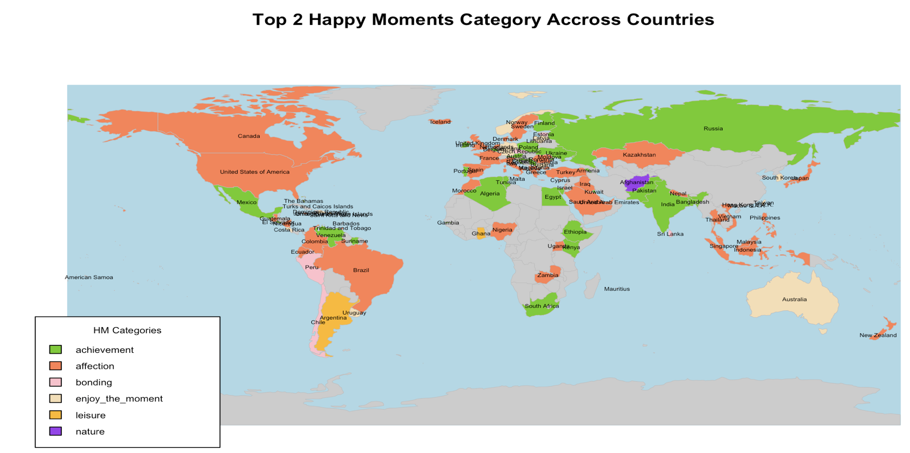
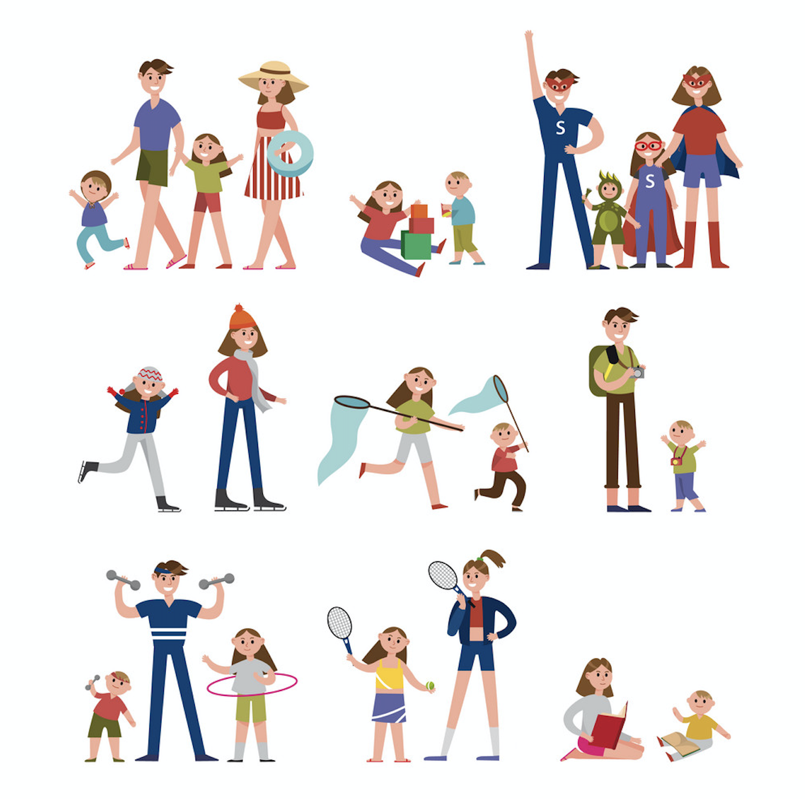

# Project 1: What makes people happy?

#

### Step 0: check and install needed packages. Load the libraries and functions. 
```{r, echo = FALSE, message=FALSE, warning=FALSE}
packages.used= c("dplyr","waffle","rworldmap","tidyverse","tidytext",'gridExtra','ggplot2', 'wordcloud')

# check packages that need to be installed.
packages.needed=setdiff(packages.used, 
                        intersect(installed.packages()[,1], 
                                  packages.used))
# install additional packages
if(length(packages.needed)>0){
  install.packages(packages.needed, dependencies = TRUE)
}
```


```{r, message=FALSE, warning=FALSE}
# load packages
library(dplyr)
library(waffle)
library(rworldmap)
library(tidyverse)
library(tidytext)
library(wordcloud)
library(ggplot2)
library(gridExtra)

```

This notebook was prepared with the following environmental settings.

```{r}
print(R.version)
```

### Step 1: Load and Merge Data For Analysis : 

In this project, I combined the demographic data from <https://raw.githubusercontent.com/rit-public/HappyDB/master/happydb/data/demographic.csv> and the cleaned processed happy moments text data <"processed_moments.csv"> generated by `Tex_Processing.rmd` together for the following analysis.

```{r}
# Load Data 
demoURL <- 'https://raw.githubusercontent.com/rit-public/HappyDB/master/happydb/data/demographic.csv'
demoData <- read.csv(demoURL)
hm_data <- read.csv("../output/processed_moments.csv")

pro_moments_demo <- merge(demoData, hm_data, by = c('wid'))         ## Merge two dataframe by workder id
pro_moments_demo$age <- as.numeric(gsub("[A-Za-zčá]",               ## Clean the age variable
                                        "",as.character(pro_moments_demo$age)))  
head(pro_moments_demo)
```

### Step 2: Exploratary Data Analysis

`Question 1 to think` before we go:

+ What are the top happy moments categories that data tells us?
+ Does the length of reflection period actually influence how people recall their happy moments?

##### In order to figure these out, I visualize the data with square pie chart as following:

```{r,echo= FALSE,message=FALSE, warning=FALSE}
hm_data24h <- hm_data[hm_data$reflection_period == '24h',]
hm_data3m <- hm_data[hm_data$reflection_period == '3m',]

# Square Pie Chart for happy moments category in past 24 hours
vals <- as.vector(table(hm_data24h$predicted_category))
val_names <- sprintf("%s (%s)", names(table(hm_data24h$predicted_category)), scales::percent(round(vals/sum(vals), 3)))
names(vals) <- val_names

# Square Pie Chart for happy moments category in past 3 months
vals3m <- as.vector(table(hm_data3m$predicted_category))
val_names3m <- sprintf("%s (%s)", names(table(hm_data3m$predicted_category)), scales::percent(round(vals3m/sum(vals3m), 3)))
names(vals3m) <- val_names3m
```


```{r, echo= FALSE,message=FALSE, warning=FALSE}
waffle(vals/300, rows = 10,use_glyph= TRUE,title = 'Predicted Happy Moments Category in Past 24 Hours') 
```

Top 3 Happy Moments Categories in past 24 Hours are: `affection (32.9%)`,`achievement (30.9%)`,`enjoy_the_moment (13.3%)`. 


```{r,echo= FALSE,message=FALSE, warning=FALSE}
waffle(vals3m/300, rows = 10,use_glyph= TRUE,title = 'Predicted Happy Moments Category in Past 3 Months')
```

Top 3 Happy Moments Categories in past 3 Months are: `achievement (36.6%)`,`affection (35.2%)`,`bonding (10.9%)`.      

\newline

\newline

##### As we can see from the square pie chart above:

+ In the past 24 hours/3 months, most people are happy for moments related to achievement, affection, enjoy_the_moment, and bonding. 

+ As the reflection period gets longer, the percentage of small/daily moments, *such as enjoy_the_moment, exercise, leisure and nature*, decline overall; but the big/unsual moments, *such as achievement, affection, and bonding*, increases. 

This actually makes sense. Since when reflection period gets shorter, a small moment that makes people happy could be much more impressive than longer reflection period; whereas the the reflection period gets longer, big moments related to achievement, affection or bondings could be much more impressive and memorable.      


```{r, echo= FALSE,message=FALSE, warning=FALSE}
# Find top happy moment for each country 
unique_country <- as.character(unique(pro_moments_demo$country))     
#### unique workder id in cleaned_hm

hm_country_category_df <- matrix(NA, nrow = length(unique_country), ncol = 6,dimnames = 
                                 list(c(),c('country','Top1HM_Categories', 'Top2HM_Categories','Top3HM_Categories','Top1_Cate_Freq','Total_HM')))

for (i in 1:length(unique_country)) {
  tb <- table(pro_moments_demo[pro_moments_demo$country == unique_country[i], 'predicted_category'])
  sorted_tb <- sort(tb,decreasing = TRUE)
  hm_country_category_df[i,] <- c(unique_country[i], names(sorted_tb[1]),names(sorted_tb[2]),
                                  names(sorted_tb[3]), max(tb), sum(tb))
}

##change the data structure
hm_country_category_df <- as.data.frame(hm_country_category_df)

hm_country_category_df$Top1_Cate_Freq <-as.numeric(as.character(hm_country_category_df$Top1_Cate_Freq))
hm_country_category_df$Total_HM <- as.numeric(as.character(hm_country_category_df$Total_HM ))

```


```{r, echo = FALSE}
HMWorldMap <- function(data, HM_cat_toPlot, plottitle, mycolors){
  malMap1 <- joinCountryData2Map(data, joinCode = "ISO3",
                              nameJoinColumn = 'country' )
  # get the coordinates for each country
  country_coord1<-data.frame(coordinates(malMap1[is.na(malMap1$country)== FALSE,]),stringsAsFactors=F)
  
  mapCountryData(malMap1, nameColumnToPlot=HM_cat_toPlot , 
                 catMethod = "categorical",mapTitle= plottitle,
                 missingCountryCol = gray(.8), colourPalette = mycolors, 
                 oceanCol ='lightblue',addLegend=FALSE)
  
  # label the countries
  text(x=country_coord1$X1,y=country_coord1$X2,
       labels=row.names(country_coord1), cex = 0.4 , font = 1.5)

  legend("bottomleft", inset=.001, title="HM Categories", cex = 0.65,
         levels(data[,HM_cat_toPlot]), fill=mycolors, horiz=FALSE)
}
```

\newline

\newline

##### The number of happy moments across countries:

```{r}
sort(table(pro_moments_demo$country), decreasing = TRUE)
```

\newline


##### Even though the happy moments in this dataset are not evenly distributed across different countries, it is still valuable for us to think about the following questions: 

`Question 2 to think`:

+ Do happy moments vary across countries?

+ If so, what does the pattern show?

{ width=40% }  


Here, I visualized the top1 and top2 happy moments categories on the world map to help us get a general sense of this question (`Keep in Mind`: this could be much better if we were able to have more balanced sample).

\newline
```{r, echo= FALSE,message=FALSE, warning=FALSE}
mycolors1 <- c( 'chartreuse3', 'coral','pink',  'wheat','darkgoldenrod1')
mycolors2 <- c( 'chartreuse3', 'coral','pink',  'wheat','darkgoldenrod1', 'purple')

par(mfrow = c(1,1))

# Comment out the following two lines if you want see how it plot

#HMWorldMap(hm_country_category_df,"Top1HM_Categories",'Top 1 Happy Moments Category Accross Countries', mycolors1)

#HMWorldMap(hm_country_category_df,"Top2HM_Categories",'Top 2 Happy Moments Category Accross Countries', mycolors2)
```




##### As we can see from the world maps above:

+ Most of countries in `North & South America Continents` (USA, Cananda, Brazil, Columbia,etc) and `Western Europe` (UK, France, etc.) have top1 happy moments belonging to `achievement`, and top2 happy moments with `affection`.

+ In most `Asia` countries, people are more often happy for their `affection` and `achievement`. 

+ For countries in `Middle East and Africa`, people are often happy for various moments. However, compaired with other countries, categories like `affection` and `bonding` could play a much more important role in `Middle East and Africa`.

+ `Russia and Australia` are kind of special but much similar in what makes their people happy, since the top1 and top2 happy moments categories in Russia are `enjoy_the_moment` & `achievement`; whereas in Australia,  `achievement` & `enjoy_the_moment` are the top1 and top2 categories. 


### Now Let's go deeper to have a look at what actually makes people happy.

### Step 3: Words exploration.

```{r, echo= FALSE,message=FALSE, warning=FALSE}
cols_used <- c('hmid',"wid", "age","country","gender","marital", "parenthood","predicted_category",'cleaned_hm',"text")
df <- pro_moments_demo[,cols_used]
df$text <- as.character(df$text)
token_df <- df %>% unnest_tokens(word, text)  

# Function to capitalize words
firstup <- function(x) {
   substr(x, 1, 1) <- toupper(substr(x, 1, 1))
x
}

```

Below, I plotted the top 10 most frequent words used to express happy moments under 7 different categories:


```{r, echo= FALSE,message=FALSE, warning=FALSE}
word_barplot <- function(ori_data, unique_levels, col_name, words_length, nrow ){
  p = list()
  
  for (i in 1:length(unique_levels)){
  tb = table(ori_data[ori_data[,col_name] == unique_levels[i], 'word'])
  data <- data.frame(sort(sort(tb,decreasing = TRUE)[1:words_length]))
  
  p[[i]] <- data %>% mutate(name = fct_reorder(Var1, Freq )) %>%
    ggplot( aes(x=Var1, y=Freq)) +
    geom_bar(stat="identity") +
    ylab("Freq") + xlab("Words")+
    theme(plot.title = element_text(size=8))+
    ggtitle(firstup(unique_levels[i])) +
    coord_flip()
  } 
  
  gridExtra::grid.arrange(grobs = p, nrow = nrow)
}
```

```{r, echo= FALSE,message=FALSE, warning=FALSE}
hm_categories <- levels(token_df$predicted_category)

word_barplot(ori_data = token_df , unique_levels = hm_categories, col_name = 'predicted_category', 
             words_length = 10, nrow = 2)
```

Also, the most frequent 60 words through wordclouds as following:


```{r, echo= FALSE,message=FALSE, warning=FALSE}
par(mfrow=c(2,4))

for (i in 1:length(hm_categories)){
  tb = table(token_df[token_df$predicted_category == hm_categories[i], 'word'])
  cloudData <- data.frame(sort(tb,decreasing = TRUE)[1:60])
  wordcloud(cloudData$Var1, cloudData$Freq,scale=c(2.5,0.35),min.freq = 5, colors=brewer.pal(8, "Dark2"), random.order=FALSE)
  title(firstup(hm_categories[i]))

} 

```

##### As we can see from the bar plots and wordclouds above, happy moments are like:

+ `achievement`: doing well with job/exam/school/game/project, bought a car/house, got raise/bonus/money/promotions etc.

+ `affection`: had a great time with family members/boy or girl friends, etc.

+ `bonding`: had a great time with friends

+ `enjoy_the_moment`/ `exercise`/ `leisure`: had a great time with oneself, such as ate something nice/relax/workout/read books/watch movies and etc.

+ `nature`: walked in the nature, saw a nice view, etc


##### So far, based on all the information we received from data, here are: 

`A few questions to think`:

+ Whether some people are more likely to be happy for achievement?

+ while, whether some are more likely to be happy for having a great time with family/friends (affection & bonding)?

+ or, others are more likely to be happy for having a great time with his or her self (enjoy_the_moment, exercise, leisure, nature)?

##### In order to answers these questions, let's explore more.


```{r, echo = FALSE}
df <- token_df
df$ageLevel <- cut(df$age, breaks=c(2, 21, 35, 45, 55, Inf), labels=c("under21","21-35","35-45", "45-55","above55"))

df$new_category[df$predicted_category == "affection" | df$predicted_category == "bonding"] <- 'family_friends'
df$new_category[df$predicted_category == "achievement"] <- "achievement"
df$new_category[df$predicted_category == "enjoy_the_moment" | df$predicted_category == "exercise" |df$predicted_category == "leisure"] <- 'self_time'
df$new_category[df$predicted_category == "nature"]  <-  "nature"
df$new_category <- as.factor(df$new_category)
```

```{r, echo = FALSE}
new_df <-df[,c('ageLevel','country','gender','marital','parenthood','predicted_category','new_category', 'word')]
test <- data.frame(lapply(new_df, as.character), stringsAsFactors=FALSE)
test <- test[!((test$country =="") | (test$gender == "") | (test$marital =="") | (test$parenthood =="")), ]
test <- data.frame(lapply(test, as.factor), stringsAsFactors=TRUE)

```


```{r, echo = FALSE}
hm_parenthood <- levels(test$parenthood)
word_barplot(ori_data = test , unique_levels = hm_parenthood, col_name = 'parenthood', 
             words_length = 20, nrow = 1)
```


+ people with `no parenthood` are more likely to recall happy moments with words from `bonding`,`enjoy_the_moment`,`leisure`, `achievement`.

+ however, people with `parenthood` are more likely to recall happy moments with words from `affection`.


```{r, echo = FALSE}
hm_gender <- levels(test$gender)
word_barplot(ori_data = test , unique_levels = hm_gender, col_name = 'gender', 
             words_length = 20, nrow = 1)
```

+ There seems to be no much difference in the components of happy moments across genders, since all three types of genders are composed of affections, bonding, achievement, etc.


```{r, echo = FALSE}
hm_marital <- levels(test$marital) 
word_barplot(ori_data = test , unique_levels = hm_marital, col_name = 'marital', 
             words_length = 20, nrow = 1)
```

+ Also, there seems to be no much difference in the components of happy moments across marital status, since all three types of genders are composed of affections, bonding, achievement, etc.

+ However, this does not mean marital status is not significant with other status combined, such as gender, parenthood, etc. Further investigation may be needed.


```{r, echo = FALSE}
hm_ageLevel <- levels(test$ageLevel) 
word_barplot(ori_data = test , unique_levels = hm_ageLevel, col_name = 'ageLevel', 
             words_length = 15, nrow = 2)
```

There are two slightly obvious trends in gender： 

+ For people with age under 35, they are more likely to be happy about personal bondings, affections, and enjoy_the_moments.

+ But for age above 35,  most of the happy moments coming from family, which belongs to affection. 


### Summary:

1. When reflection period of recalling happy moments decreases, daily moments that make people happy could be much more impressive than those recalled with longer reflection period; however, as the the reflection period goes longer, unusual moments related to achievement, affection or bondings could be much more impressive and memorable. 

2. The most commom happy moment in somehow varies across different contries of residence. The pattern itself has some rule across different continents as well. Even though the happy moments in this dataset are not evenly distributed across countries, it is still valuable for us to think. And, maybe we could further investigated this part, if more balanced dataset is available. 

3. Although the details of happy moments are quite diverse, there are still much similarities when comes to specific situations. For example, people are happy b/c:
  
  + `achievement`: did well with job/exam/school/game/project, bought a car/house, got raise/bonus/money/promotions etc.
  
  + `affection`: had a great time with family members/boy or girl friends.
  
  + `bonding`: had a great time/dinner/fun with friends.
  
  + `enjoy_the_moment`/ `exercise`/ `leisure`: had a great time with oneself, such as ate something nice/relax/workout/read books/watch movies and etc.
  
  + `nature`: walked in the nature, saw a nice view, etc


4. Young, single, no parenthood people are more likely to be happy for their affection, bondings,  personal time, or acheivement; whereas, old, parental people are more commonly happy for their family affection.


